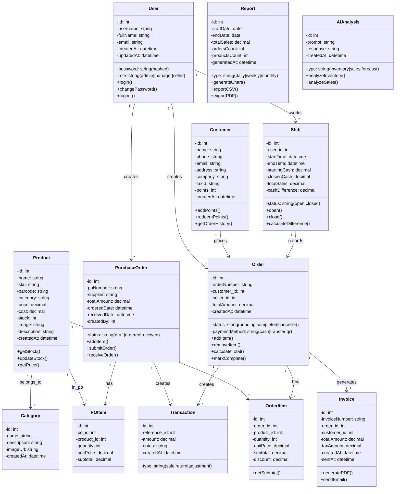

# Class Diagram - POS Văn Phòng Phẩm

## Mô tả các Class chính

### 1. **User** - Người dùng hệ thống
- Quản lý tài khoản, mật khẩu, vai trò (admin, manager, seller)
- Liên kết với các Order, Shift, PurchaseOrder

### 2. **Product** - Sản phẩm
- Quản lý thông tin sản phẩm, giá, tồn kho
- Liên kết với Category, OrderItem, POItem

### 3. **Order** - Đơn bán hàng
- Lưu thông tin đơn hàng, khách hàng, tổng tiền
- Chứa nhiều OrderItem (từng dòng sản phẩm)
- Tạo Invoice GTGT

### 4. **OrderItem** - Chi tiết từng dòng đơn hàng
- Lưu sản phẩm, số lượng, đơn giá
- Tính subtotal riêng cho mỗi item

### 5. **Customer** - Khách hàng
- Quản lý thông tin khách hàng, điểm tích lũy
- Lịch sử mua hàng liên kết với Order

### 6. **Shift** - Ca làm việc
- Lưu thời gian mở/chốt ca, tiền đầu ca, tiền chốt
- Liên kết với User và Order

### 7. **PurchaseOrder** - Đơn hàng nhập
- Quản lý đơn nhập từ nhà cung cấp
- Chứa nhiều POItem

### 8. **Invoice** - Hóa đơn GTGT
- Tạo từ Order, có thể gửi email hoặc xuất PDF
- Liên kết với Order và Customer

### 9. **Transaction** - Giao dịch
- Lưu record của mỗi giao dịch (bán, trả, điều chỉnh)
- Tham chiếu đến Order hoặc PO

### 10. **Report** - Báo cáo
- Sinh báo cáo theo kỳ (ngày, tuần, tháng)
- Có thể xuất biểu đồ, CSV, PDF

### 11. **AIAnalysis** - Phân tích AI
- Lưu trữ request và response từ Ollama
- Hỗ trợ phân tích tồn kho, bán hàng

### 12. **Category** - Danh mục sản phẩm
- Phân loại sản phẩm, quản lý hình ảnh
