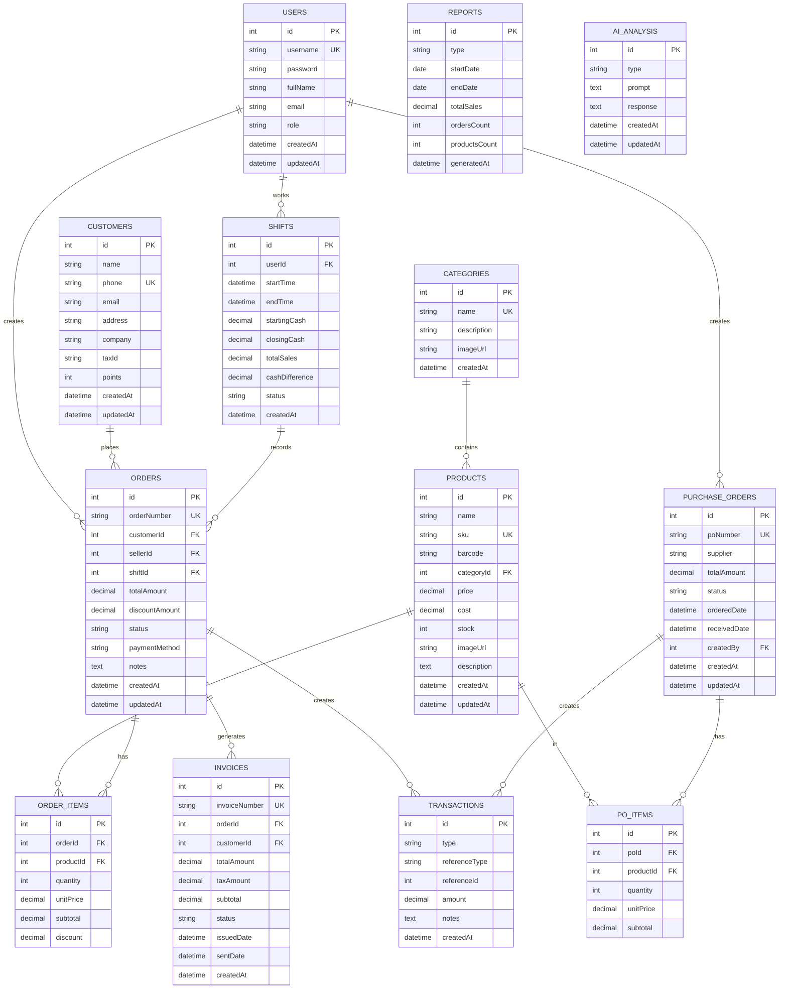

# Database ER Diagram - POS Văn Phòng Phẩm



## Chi tiết các bảng

### USERS (Người dùng)
- Lưu thông tin người dùng hệ thống
- **Vai trò:** admin, manager, seller
- **Khóa chính:** id
- **Khóa duy nhất:** username

### CUSTOMERS (Khách hàng)
- Lưu thông tin khách hàng, điểm tích lũy
- **Khóa chính:** id
- **Khóa duy nhất:** phone

### CATEGORIES (Danh mục)
- Phân loại sản phẩm
- **Khóa chính:** id
- **Khóa duy nhất:** name

### PRODUCTS (Sản phẩm)
- Thông tin sản phẩm, giá, tồn kho
- **Khóa chính:** id
- **Khóa duy nhất:** sku, barcode
- **Khóa ngoài:** categoryId

### ORDERS (Đơn bán hàng)
- Tạo mỗi khi bán hàng
- **Trạng thái:** pending, completed, cancelled
- **Phương thức thanh toán:** cash, transfer, qr
- **Khóa ngoài:** customerId, sellerId, shiftId

### ORDER_ITEMS (Chi tiết đơn hàng)
- Từng dòng sản phẩm trong đơn
- **Khóa ngoài:** orderId, productId
- Nhiều-một với Orders và Products

### SHIFTS (Ca làm việc)
- Ghi nhận ca làm việc
- **Trạng thái:** open, closed
- Tính chênh lệch tiền mặt

### PURCHASE_ORDERS (Đơn hàng nhập)
- Quản lý đơn nhập từ nhà cung cấp
- **Trạng thái:** draft, ordered, received
- **Khóa duy nhất:** poNumber

### PO_ITEMS (Chi tiết đơn nhập)
- Từng dòng sản phẩm trong đơn nhập
- **Khóa ngoài:** poId, productId

### INVOICES (Hóa đơn GTGT)
- Hóa đơn GTGT từ đơn hàng
- **Trạng thái:** draft, issued, sent, cancelled
- **Khóa ngoài:** orderId, customerId

### TRANSACTIONS (Giao dịch)
- Lưu trữ tất cả các giao dịch
- **Loại:** sale, return, adjustment
- Tham chiếu đến Order hoặc PO

### REPORTS (Báo cáo)
- Lưu báo cáo đã tạo
- **Loại:** daily, weekly, monthly
- Dữ liệu được tính toán sẵn

### AI_ANALYSIS (Phân tích AI)
- Lưu request và response từ Ollama
- **Loại:** inventory, sales, forecast

---

## Các mối quan hệ chính

| Mối quan hệ | Mô tả |
|-----------|-------|
| USERS → ORDERS | Nhân viên tạo đơn hàng (1 user : nhiều orders) |
| USERS → SHIFTS | Nhân viên mở ca (1 user : nhiều shifts) |
| CUSTOMERS → ORDERS | Khách hàng đặt hàng (1 customer : nhiều orders) |
| ORDERS → ORDER_ITEMS | Đơn hàng có nhiều dòng sản phẩm |
| PRODUCTS → ORDER_ITEMS | Sản phẩm có thể xuất hiện trong nhiều đơn |
| ORDERS → INVOICES | Mỗi đơn có thể tạo 1 hóa đơn GTGT |
| SHIFTS → ORDERS | Ca làm việc ghi nhận các đơn bán |
| PURCHASE_ORDERS → PO_ITEMS | Đơn nhập có nhiều dòng sản phẩm |
| CATEGORIES → PRODUCTS | Danh mục chứa nhiều sản phẩm |

---

## Chỉ mục (Indexes) để tối ưu truy vấn

```sql
-- Users
CREATE UNIQUE INDEX idx_users_username ON USERS(username);

-- Products  
CREATE UNIQUE INDEX idx_products_sku ON PRODUCTS(sku);
CREATE UNIQUE INDEX idx_products_barcode ON PRODUCTS(barcode);
CREATE INDEX idx_products_category ON PRODUCTS(categoryId);

-- Orders
CREATE UNIQUE INDEX idx_orders_number ON ORDERS(orderNumber);
CREATE INDEX idx_orders_customer ON ORDERS(customerId);
CREATE INDEX idx_orders_seller ON ORDERS(sellerId);
CREATE INDEX idx_orders_created ON ORDERS(createdAt);
CREATE INDEX idx_orders_status ON ORDERS(status);

-- Customers
CREATE UNIQUE INDEX idx_customers_phone ON CUSTOMERS(phone);
CREATE INDEX idx_customers_created ON CUSTOMERS(createdAt);

-- Shifts
CREATE INDEX idx_shifts_user ON SHIFTS(userId);
CREATE INDEX idx_shifts_date ON SHIFTS(startTime);

-- Purchase Orders
CREATE UNIQUE INDEX idx_po_number ON PURCHASE_ORDERS(poNumber);
CREATE INDEX idx_po_status ON PURCHASE_ORDERS(status);

-- Invoices
CREATE UNIQUE INDEX idx_invoices_number ON INVOICES(invoiceNumber);
CREATE INDEX idx_invoices_order ON INVOICES(orderId);
CREATE INDEX idx_invoices_created ON INVOICES(createdAt);
```
