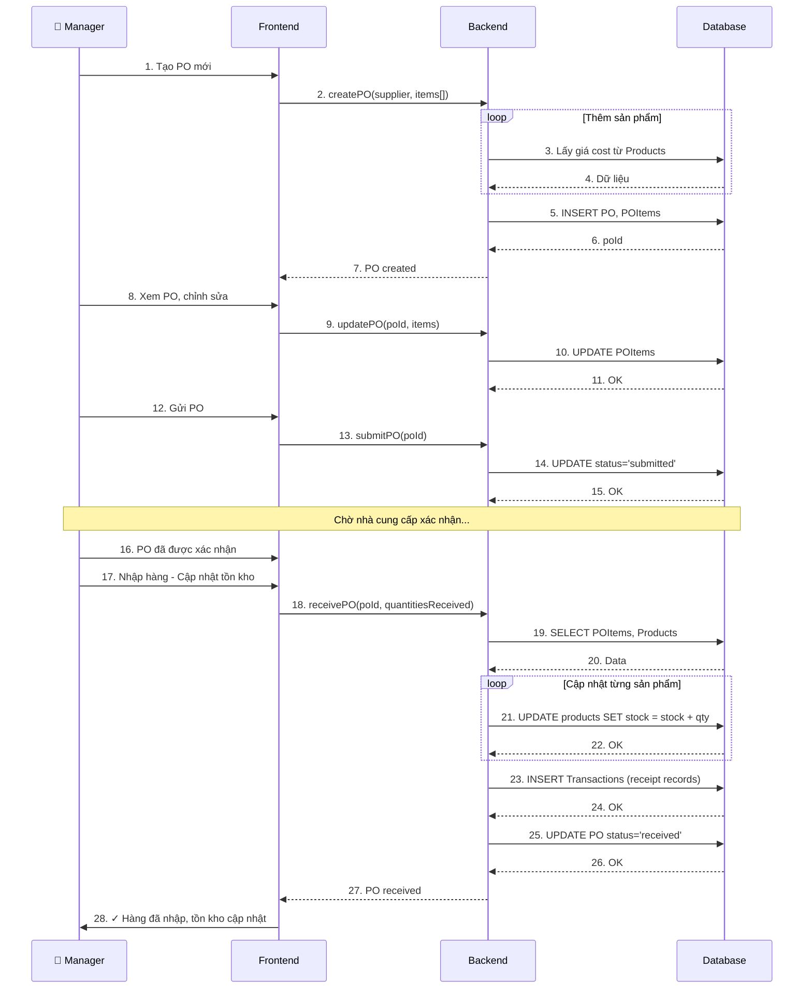
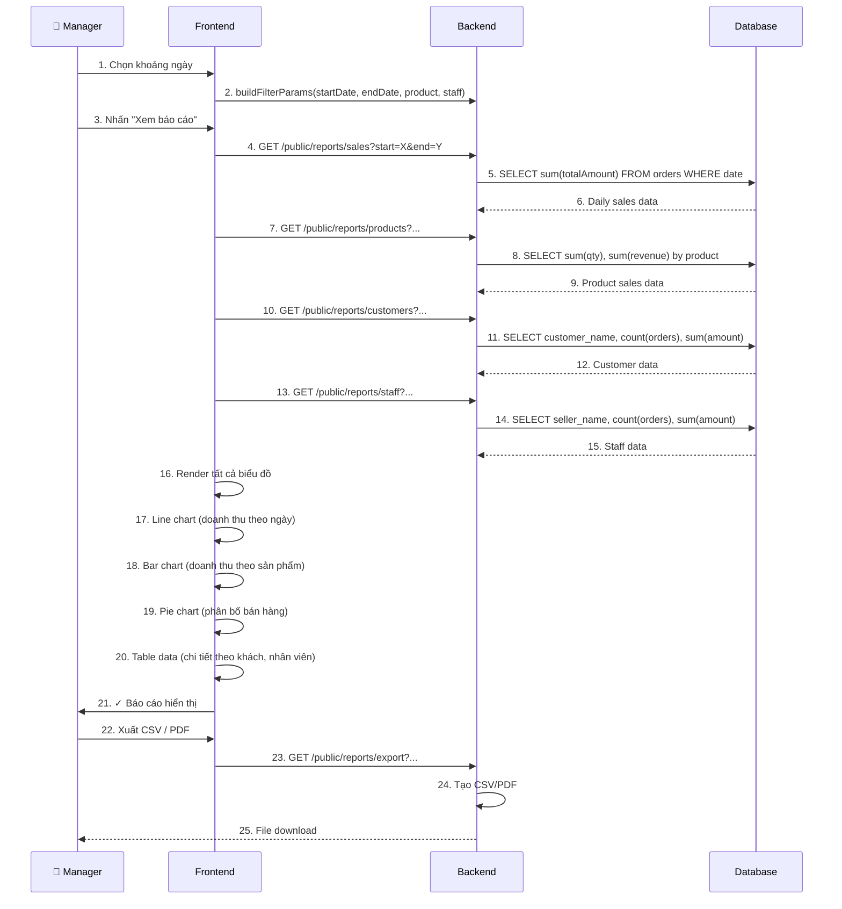
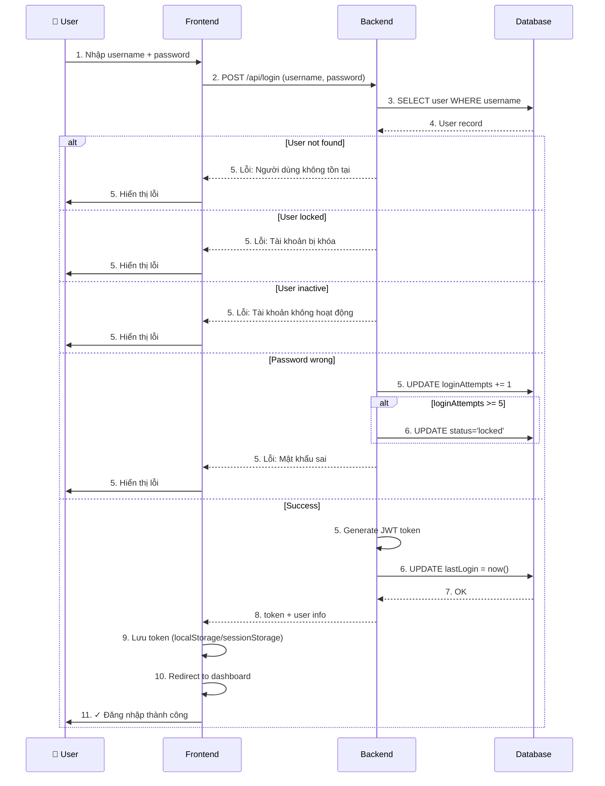

# Sequence Diagram - POS Văn Phòng Phẩm

## 1. Flow Bán hàng (Selling Process)

```mermaid
sequenceDiagram
    participant Seller as 🛍️ Seller
    participant UI as Frontend<br/>(UI)
    participant API as Backend<br/>(API)
    participant DB as Database<br/>(MySQL)
    participant Email as Email<br/>(SMTP)
    
    Seller->>UI: 1. Chọn sản phẩm, khách hàng
    UI->>API: 2. Tạo đơn hàng (createOrder)
    API->>DB: 3. Lưu đơn, OrderItems
    DB-->>API: 4. OK, orderID
    API-->>UI: 5. Trả về đơn hàng
    UI->>UI: 6. Hiển thị đơn
    
    Seller->>UI: 7. Chọn thanh toán (tiền mặt/QR)
    UI->>API: 8. Xác nhận thanh toán
    API->>DB: 9. Cập nhật trạng thái Order → Completed
    API->>DB: 10. Cập nhật tồn kho (Stock -= qty)
    API->>DB: 11. Tích lũy điểm khách
    DB-->>API: 12. OK
    
    API->>DB: 13. Tạo Invoice (hóa đơn GTGT)
    DB-->>API: 14. invoiceID
    
    API->>API: 15. Tạo PDF (pdfkit)
    API->>Email: 16. Gửi email có kèm PDF
    Email-->>API: 17. Email sent
    
    API->>DB: 18. Lưu Transaction record
    DB-->>API: 19. OK
    
    API-->>UI: 20. Thanh toán thành công
    UI->>Seller: 21. ✓ Đơn hàng hoàn tất
    
    note over Seller,Email
        Tổng thời gian: ~2-5 giây
        (kể cả thời gian gửi email)
    end note
```

## 2. Flow Mở/Chốt Ca

```mermaid
sequenceDiagram
    participant Manager as 👔 Manager
    participant UI as Frontend
    participant API as Backend
    participant DB as Database
    
    Manager->>UI: 1. Nhấn "Mở ca"
    UI->>UI: 2. Hiện modal nhập tiền đầu ca
    Manager->>UI: 3. Nhập số tiền
    UI->>API: 4. openShift(startingCash)
    API->>DB: 5. INSERT Shift record
    API->>DB: 6. SET status = 'open'
    DB-->>API: 7. shiftID
    API-->>UI: 8. Shift opened
    UI->>Manager: 9. ✓ Ca đã mở
    
    Note over Manager,DB: Ca hoạt động...
    
    Manager->>UI: 10. Nhấn "Chốt ca"
    UI->>UI: 11. Hiện modal nhập tiền chốt
    Manager->>UI: 12. Nhập số tiền hoặc đếm mệnh giá
    UI->>API: 13. closeShift(closingCash, shiftId)
    API->>DB: 14. SELECT SUM(totalAmount) FROM orders WHERE shiftId
    DB-->>API: 15. totalSales
    API->>API: 16. Tính: difference = closingCash - (startingCash + totalSales)
    API->>DB: 17. UPDATE Shift: status='closed', closingCash, difference
    DB-->>API: 18. OK
    API-->>UI: 19. Shift closed
    UI->>Manager: 20. ✓ Ca đã chốt (chênh lệch: X đ)
    
    note over Manager,DB
        Các đơn hàng bán trong ca
        sẽ link vào shift này
    end note
```

## 3. Flow Tạo và Gửi Hóa đơn GTGT

```mermaid
sequenceDiagram
    participant Manager as 👔 Manager
    participant UI as Frontend
    participant API as Backend
    participant DB as Database
    participant PDFLib as PDF Lib
    participant Email as Email Server
    
    Manager->>UI: 1. Chọn đơn hàng, yêu cầu GTGT
    UI->>API: 2. createInvoice(orderId, customerInfo)
    API->>DB: 3. SELECT Order, OrderItems, Customer
    DB-->>API: 4. Order data
    API->>DB: 5. INSERT Invoice record
    DB-->>API: 6. invoiceId
    API->>PDFLib: 7. Tạo PDF hóa đơn
    PDFLib->>PDFLib: 8. Format tiếng Việt (Unicode)
    PDFLib-->>API: 9. PDF buffer
    API->>API: 10. Lưu PDF vào temp/file
    API->>API: 11. Prepare email content
    API->>Email: 12. Gửi email + attachment (PDF)
    Email-->>API: 13. Email sent successfully
    API->>DB: 14. UPDATE Invoice: status='sent', sentAt=now()
    DB-->>API: 15. OK
    API-->>UI: 16. Invoice sent
    UI->>Manager: 17. ✓ Hóa đơn đã gửi
    
    note over Manager,Email
        Email có attachment PDF
        Khách hàng nhận được hóa đơn
    end note
```

## 4. Flow Quản lý Đơn hàng nhập (PO)



## 5. Flow Phân tích AI tồn kho

```mermaid
sequenceDiagram
    participant Manager as 👔 Manager
    participant UI as Frontend
    participant API as Backend
    participant DB as Database
    participant Ollama as Ollama AI
    
    Manager->>UI: 1. Nhấn "Phân tích tồn kho"
    UI->>API: 2. GET /public/reports/products (top 10)
    API->>DB: 3. SELECT top 10 products by sales
    DB-->>API: 4. Product data (name, qty, revenue, stock)
    API-->>UI: 5. Data received
    UI->>UI: 6. Hiển thị biểu đồ
    
    API->>API: 7. Tạo prompt cho Ollama
    API->>Ollama: 8. POST /api/chat (prompt + product data)
    Ollama->>Ollama: 9. Xử lý bằng LLM
    Ollama-->>API: 10. Response (phân tích, gợi ý nhập)
    
    API-->>UI: 11. Analysis + charts data
    UI->>UI: 12. Render 3 biểu đồ:
    UI->>UI: 13.   - Biểu đồ Tồn kho
    UI->>UI: 14.   - Biểu đồ Doanh thu
    UI->>UI: 15.   - Biểu đồ Phân bố
    UI->>UI: 16. Hiển thị phân tích AI (text)
    
    UI->>Manager: 17. ✓ Phân tích hoàn tất
    
    Manager->>UI: 18. Xem gợi ý, tạo PO
    UI->>API: 19. createPO(...) - dựa vào gợi ý
    
    note over Manager,Ollama
        Response từ Ollama:
        - Sản phẩm nào cần nhập
        - Số lượng gợi ý
        - Lý do (fast-moving, low stock)
        - Dự kiến bán hết bao lâu
    end note
```

## 6. Flow Báo cáo Doanh thu



## 7. Flow Đăng nhập



---

## Tóm tắt các Flow chính

| Flow | Actors | Thời gian | Kết quả |
|------|--------|----------|--------|
| **Bán hàng** | Seller → API → DB → Email | 2-5 giây | Tạo Order, cập nhật stock, gửi invoice |
| **Mở/Chốt ca** | Manager → API → DB | 1-2 giây | Ghi nhận doanh thu, chênh lệch tiền mặt |
| **Tạo GTGT** | Manager → API → PDF → Email | 3-5 giây | Xuất PDF, gửi email cho khách |
| **Quản lý PO** | Manager → API → DB | 1-3 giây | Tạo, cập nhật, nhận hàng |
| **Phân tích AI** | Manager → API → Ollama → Chart | 3-10 giây | Render biểu đồ + gợi ý |
| **Báo cáo** | Manager → API → DB → Chart | 2-5 giây | Render các biểu đồ, table |
| **Đăng nhập** | User → API → DB | 1-2 giây | Xác thực, cấp token |
