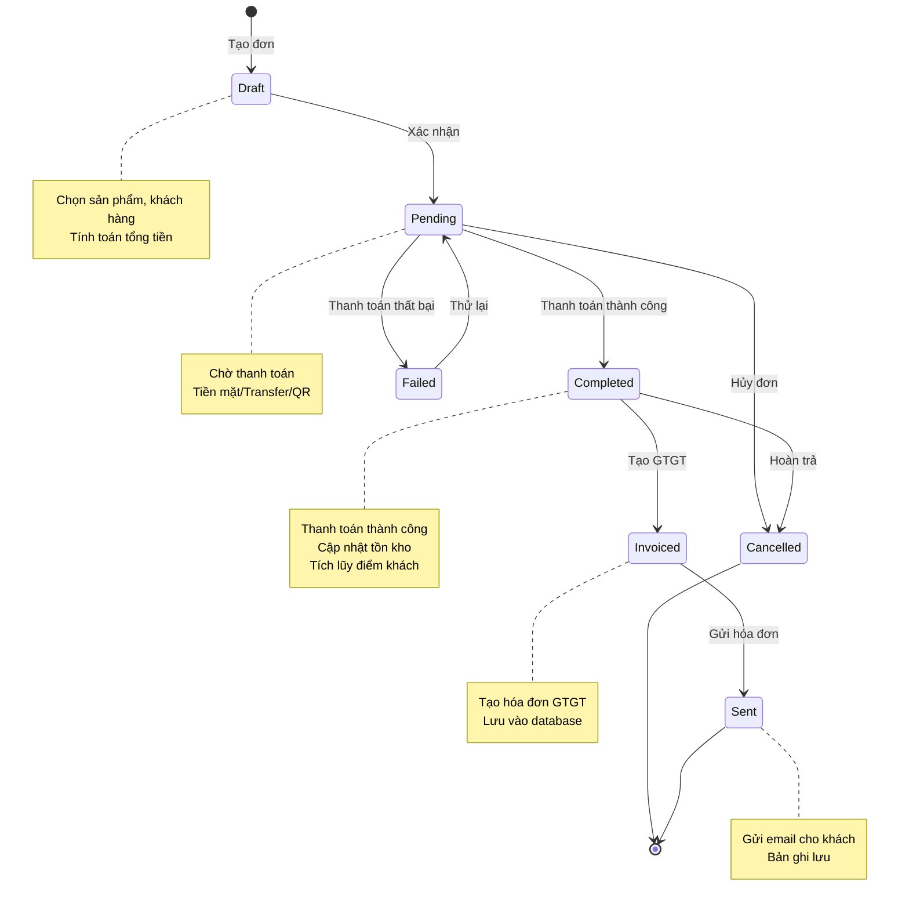
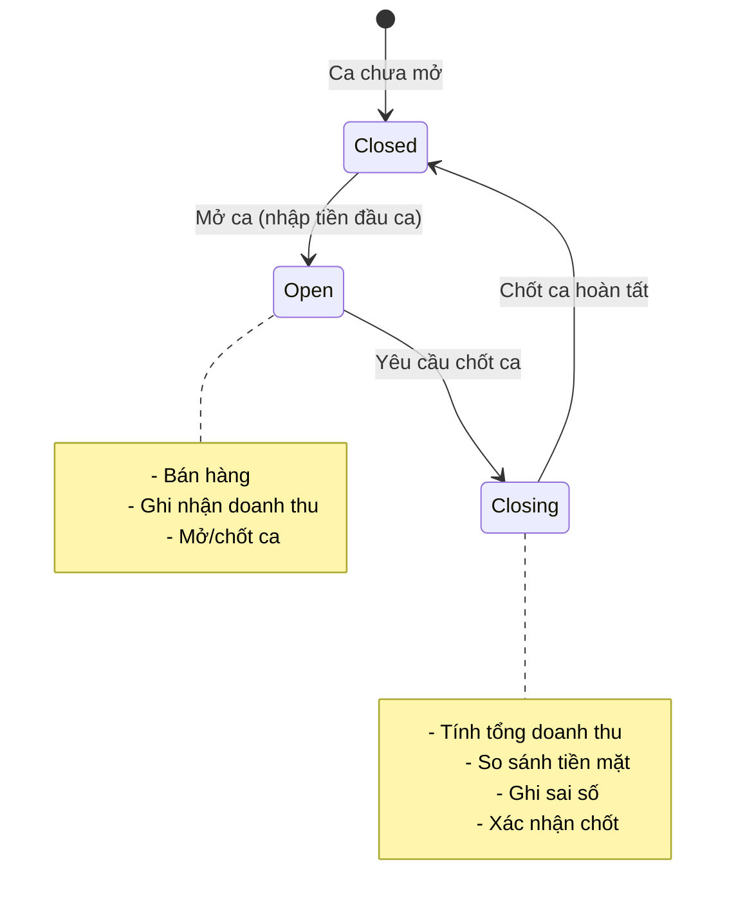
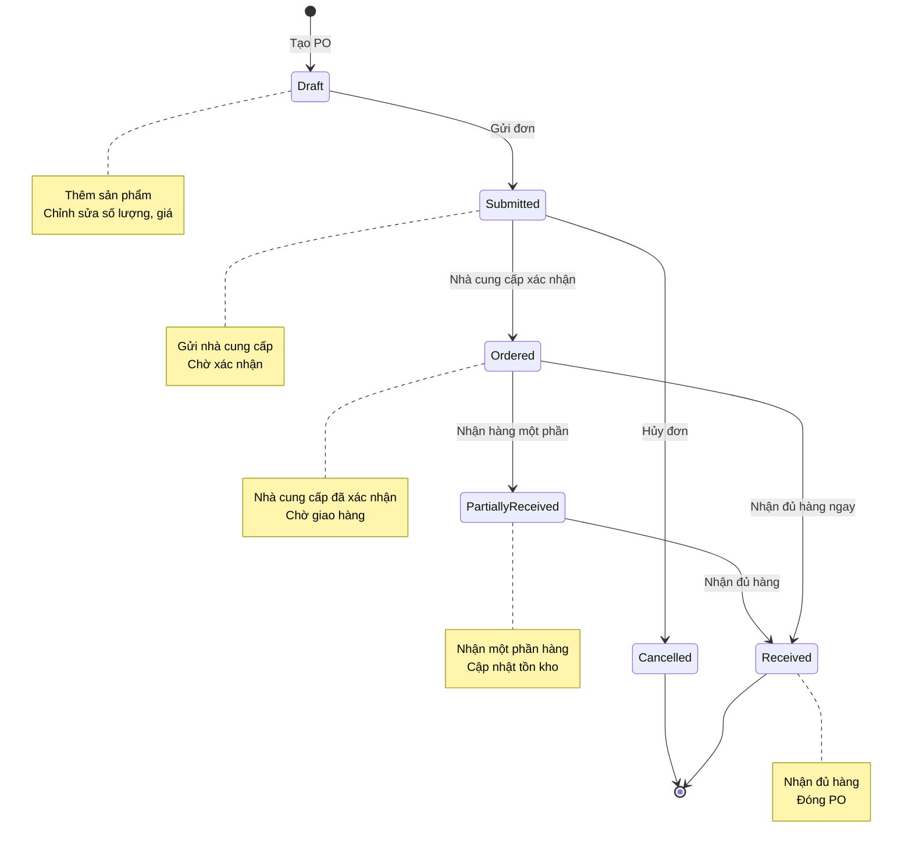
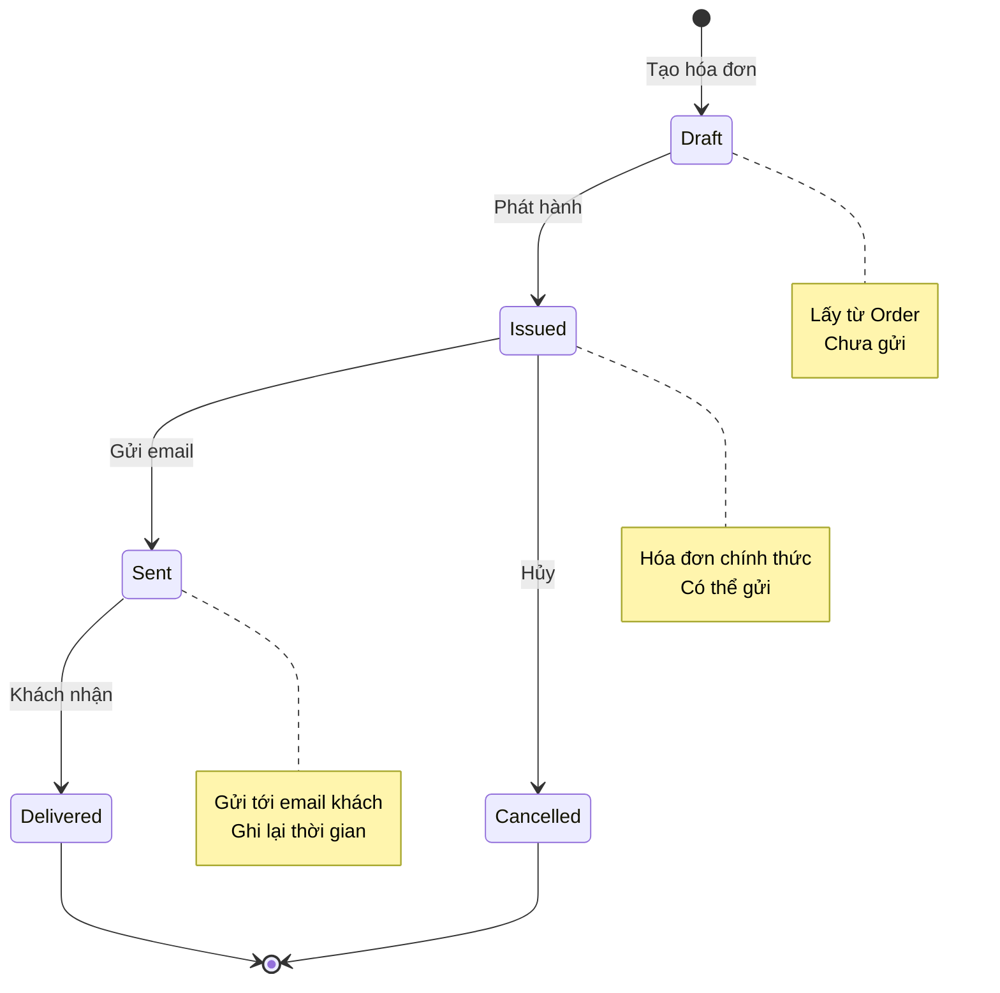
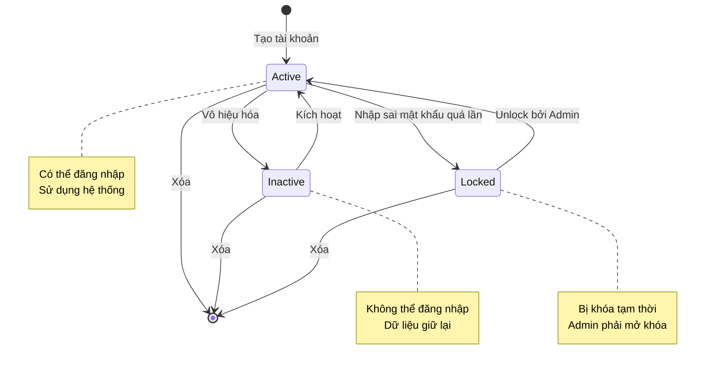
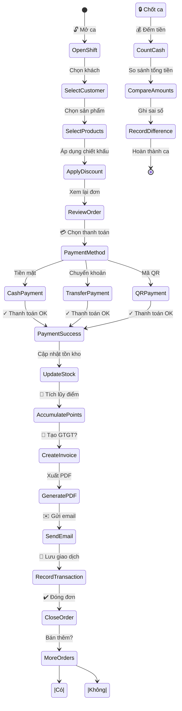
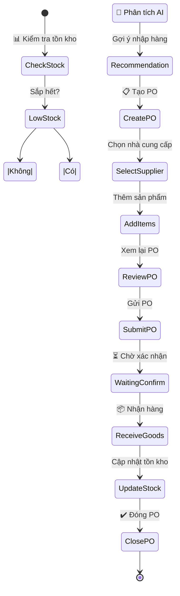
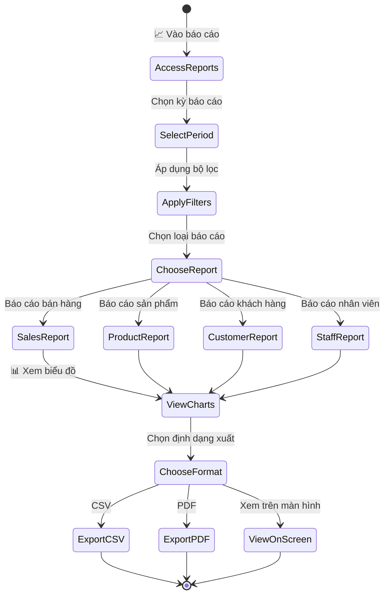
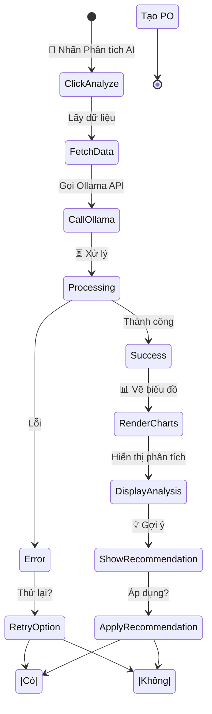

# State Diagram - POS Văn Phòng Phẩm

## 1. Trạng thái Order (Đơn hàng)

## 2. Trạng thái Shift (Ca làm việc)

## 3. Trạng thái Purchase Order (Đơn hàng nhập)

## 4. Trạng thái Invoice (Hóa đơn GTGT)

## 5. Trạng thái User (Người dùng)

---

## 6. Flow tổng quát bán hàng (End-to-End)

---

## 7. Flow quản lý hàng tồn (Inventory Management)

---

## 8. Flow báo cáo & phân tích

---

## 9. Flow phân tích AI tồn kho

---

## Bảng tóm tắt trạng thái

| Đối tượng | Trạng thái | Mô tả |
|-----------|-----------|-------|
| **Order** | Draft | Tạo đơn, chưa xác nhận |
| | Pending | Chờ thanh toán |
| | Completed | Thanh toán thành công |
| | Invoiced | Tạo hóa đơn |
| | Sent | Gửi hóa đơn |
| | Cancelled | Hủy đơn |
| **Shift** | Closed | Ca chưa mở / đã chốt |
| | Open | Ca đang mở |
| | Closing | Đang chốt ca |
| **PO** | Draft | Tạo PO, chưa gửi |
| | Submitted | Gửi nhà cung cấp |
| | Ordered | Nhà cung cấp xác nhận |
| | PartiallyReceived | Nhận hàng một phần |
| | Received | Nhận đủ hàng |
| | Cancelled | Hủy PO |
| **Invoice** | Draft | Tạo hóa đơn |
| | Issued | Phát hành |
| | Sent | Gửi email |
| | Cancelled | Hủy hóa đơn |
| **User** | Active | Tài khoản hoạt động |
| | Inactive | Tài khoản bị vô hiệu |
| | Locked | Tài khoản bị khóa |
