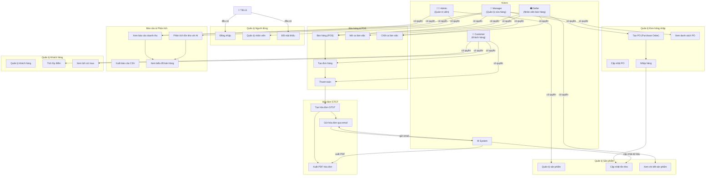

# POS Văn Phòng Phẩm - Use Case Diagram

## Hệ thống tổng quan


## Chi tiết Use Cases

### 1. **Quản lý Người dùng**

| Use Case | Actor | Mô tả |
|----------|-------|-------|
| **Đăng nhập** | Tất cả | Người dùng nhập username/password để truy cập hệ thống |
| **Quản lý nhân viên** | Admin | Admin có thể tạo, sửa, xóa tài khoản nhân viên; gán vai trò (Admin, Manager, Seller) |
| **Đổi mật khẩu** | Tất cả | Người dùng có thể thay đổi mật khẩu cá nhân |

### 2. **Bán hàng & POS**

| Use Case | Actor | Mô tả |
|----------|-------|-------|
| **Bán hàng (POS)** | Seller, Manager | Thêm sản phẩm vào giỏ, chọn khách hàng, xác nhận thanh toán |
| **Mở ca làm việc** | Seller, Manager | Ghi nhận tiền đầu ca trước khi bắt đầu bán hàng |
| **Chốt ca làm việc** | Manager | Tính tổng doanh thu, so sánh tiền mặt, ghi sai số |
| **Tạo đơn hàng** | Seller, Manager, Customer | Tạo đơn hàng mới từ giỏ hàng |
| **Thanh toán** | Seller, Manager, Customer | Xử lý thanh toán (tiền mặt, chuyển khoản, QR code) |

### 3. **Quản lý Sản phẩm**

| Use Case | Actor | Mô tả |
|----------|-------|-------|
| **Quản lý sản phẩm** | Admin | Tạo, sửa, xóa sản phẩm; quản lý danh mục, giá bán |
| **Cập nhật tồn kho** | Admin, Manager | Cập nhật số lượng tồn kho khi bán hàng hoặc nhập hàng |
| **Xem chi tiết sản phẩm** | Seller, Customer | Xem thông tin chi tiết sản phẩm, hình ảnh, giá, tồn kho |

### 4. **Quản lý Đơn hàng nhập (Purchase Order)**

| Use Case | Actor | Mô tả |
|----------|-------|-------|
| **Tạo PO** | Manager | Tạo đơn hàng nhập từ nhà cung cấp |
| **Xem danh sách PO** | Manager | Xem tất cả các đơn nhập hàng đang xử lý |
| **Cập nhật PO** | Manager | Sửa, hủy, xác nhận PO |
| **Nhập hàng** | Manager | Ghi nhận hàng đã nhập, cập nhật tồn kho |

### 5. **Hóa đơn GTGT**

| Use Case | Actor | Mô tả |
|----------|-------|-------|
| **Tạo hóa đơn GTGT** | Manager | Tạo hóa đơn GTGT từ đơn hàng |
| **Gửi hóa đơn qua email** | Manager, System | Gửi hóa đơn tới email khách hàng |
| **Xuất PDF hóa đơn** | Manager, System | Xuất hóa đơn thành file PDF |

### 6. **Báo cáo & Phân tích**

| Use Case | Actor | Mô tả |
|----------|-------|-------|
| **Xem báo cáo doanh thu** | Manager, Admin | Xem doanh thu theo ngày, tuần, tháng; lọc theo sản phẩm, nhân viên |
| **Phân tích tồn kho với AI** | Manager | Sử dụng Ollama AI để phân tích tồn kho, gợi ý nhập hàng |
| **Xuất báo cáo CSV** | Manager, Admin | Xuất báo cáo ra file CSV |
| **Xem biểu đồ bán hàng** | Manager, Admin | Xem biểu đồ cột, biểu đồ đường, biểu đồ tròn về doanh thu |

### 7. **Quản lý Khách hàng**

| Use Case | Actor | Mô tả |
|----------|-------|-------|
| **Quản lý khách hàng** | Manager, Admin | Tạo, sửa, xóa hồ sơ khách hàng |
| **Tích lũy điểm** | Customer, System | Khách hàng tích lũy điểm từ mỗi lần mua; hệ thống cập nhật tự động |
| **Xem lịch sử mua** | Customer, Manager | Xem các đơn hàng đã mua trước đây |

---

## Mối quan hệ giữa Use Cases

### Flow chính - Bán hàng
1. **Mở ca** (Seller/Manager)
2. **Bán hàng - POS** (Seller)
   - Thêm sản phẩm vào giỏ
   - Chọn khách hàng → Tích lũy điểm
3. **Tạo đơn hàng** (Tự động từ POS)
4. **Thanh toán** (Seller)
5. **Tạo hóa đơn GTGT** (Optional - Manager)
6. **Gửi hóa đơn** (Manager/System)
7. **Chốt ca** (Manager)

### Flow quản lý hàng tồn
1. **Phân tích tồn kho** (Manager + AI)
2. **Tạo PO** (Manager)
3. **Nhập hàng** (Manager)
4. **Cập nhật tồn kho** (Tự động)

### Flow báo cáo
1. **Xem báo cáo doanh thu** (Manager/Admin)
2. **Lọc dữ liệu** (Theo ngày, sản phẩm, nhân viên)
3. **Xem biểu đồ** (Biểu đồ cột nằm ngang, biểu đồ đường, pie chart)
4. **Xuất báo cáo** (CSV/PDF)

---

## Phân quyền theo vai trò

| Chức năng | Admin | Manager | Seller | Customer |
|-----------|-------|---------|--------|----------|
| Đăng nhập | ✅ | ✅ | ✅ | ✅ |
| Quản lý nhân viên | ✅ | ❌ | ❌ | ❌ |
| Quản lý sản phẩm | ✅ | ❌ | 👁️ | 👁️ |
| Bán hàng POS | ❌ | ✅ | ✅ | ❌ |
| Mở/Chốt ca | ✅ | ✅ | ✅ | ❌ |
| Quản lý PO | ❌ | ✅ | ❌ | ❌ |
| Nhập hàng | ❌ | ✅ | ❌ | ❌ |
| Tạo GTGT | ❌ | ✅ | ❌ | ❌ |
| Báo cáo doanh thu | ✅ | ✅ | ❌ | ❌ |
| Phân tích tồn kho AI | ❌ | ✅ | ❌ | ❌ |
| Quản lý khách hàng | ❌ | ✅ | 👁️ | 👁️ |
| Xem lịch sử mua | ✅ | ✅ | ❌ | ✅ |

**Chú thích:** ✅ = Có quyền đầy đủ | 👁️ = Chỉ xem | ❌ = Không có quyền

---

## Các thành phần hệ thống

```
┌─────────────────────────────────────────┐
│       POS Văn Phòng Phẩm System        │
├─────────────────────────────────────────┤
│ Frontend (index.html)                   │
│ - Dashboard, POS Interface              │
│ - Reports & Analytics                   │
│ - GTGT Invoice                          │
├─────────────────────────────────────────┤
│ Backend API (server.js)                 │
│ - Authentication & Authorization        │
│ - Orders Management                     │
│ - Products Management                   │
│ - Reports & Analytics                   │
│ - GTGT Invoice Generation               │
│ - Email Service                         │
│ - AI Analysis (Ollama Integration)      │
├─────────────────────────────────────────┤
│ Database (MySQL - Railway)              │
│ - Users, Products, Orders               │
│ - Customers, Shifts, Transactions       │
│ - POs, Invoice History                  │
├─────────────────────────────────────────┤
│ External Services                       │
│ - Email (SMTP/Gmail)                    │
│ - AI Analysis (Ollama)                  │
│ - QR Payment (VietQR)                   │
└─────────────────────────────────────────┘
```
