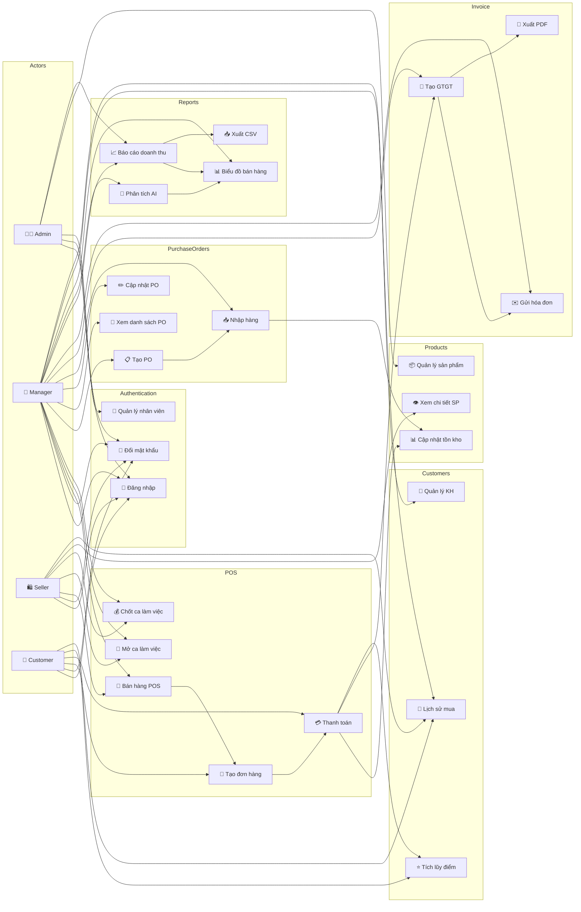

```mermaid
graph LR
    subgraph Actors
        A1["👨‍💼 Admin"]
        A2["👔 Manager"]
        A3["🛍️ Seller"]
        A4["👥 Customer"]
    end

    subgraph Authentication
        UC1["🔐 Đăng nhập"]
        UC2["🔑 Đổi mật khẩu"]
        UC3["👥 Quản lý nhân viên"]
    end

    subgraph POS
        UC4["🛒 Bán hàng POS"]
        UC5["📂 Mở ca làm việc"]
        UC6["💰 Chốt ca làm việc"]
        UC7["📝 Tạo đơn hàng"]
        UC8["💳 Thanh toán"]
    end

    subgraph Products
        UC9["📦 Quản lý sản phẩm"]
        UC10["📊 Cập nhật tồn kho"]
        UC11["👁️ Xem chi tiết SP"]
    end

    subgraph PurchaseOrders
        UC12["📋 Tạo PO"]
        UC13["📰 Xem danh sách PO"]
        UC14["✏️ Cập nhật PO"]
        UC15["📥 Nhập hàng"]
    end

    subgraph Invoice
        UC16["📄 Tạo GTGT"]
        UC17["✉️ Gửi hóa đơn"]
        UC18["📄 Xuất PDF"]
    end

    subgraph Reports
        UC19["📈 Báo cáo doanh thu"]
        UC20["🤖 Phân tích AI"]
        UC21["📊 Biểu đồ bán hàng"]
        UC22["📥 Xuất CSV"]
    end

    subgraph Customers
        UC23["👤 Quản lý KH"]
        UC24["⭐ Tích lũy điểm"]
        UC25["📜 Lịch sử mua"]
    end

    %% Admin - có quyền cao nhất
    A1 --> UC1
    A1 --> UC2
    A1 --> UC3
    A1 --> UC9
    A1 --> UC19

    %% Manager - quản lý bán hàng & hàng tồn
    A2 --> UC1
    A2 --> UC2
    A2 --> UC4
    A2 --> UC5
    A2 --> UC6
    A2 --> UC12
    A2 --> UC13
    A2 --> UC14
    A2 --> UC15
    A2 --> UC16
    A2 --> UC17
    A2 --> UC19
    A2 --> UC20
    A2 --> UC21
    A2 --> UC23
    A2 --> UC25

    %% Seller - chỉ bán hàng
    A3 --> UC1
    A3 --> UC2
    A3 --> UC4
    A3 --> UC5
    A3 --> UC6
    A3 --> UC11
    A3 --> UC25

    %% Customer - mua hàng
    A4 --> UC1
    A4 --> UC2
    A4 --> UC7
    A4 --> UC8
    A4 --> UC24
    A4 --> UC25

    %% Flow bán hàng
    UC4 --> UC7
    UC7 --> UC8
    UC8 --> UC10
    UC8 --> UC16

    %% Flow báo cáo
    UC19 --> UC21
    UC19 --> UC22
    UC20 --> UC21

    %% Flow nhập hàng
    UC12 --> UC15
    UC15 --> UC10

    %% Gửi hóa đơn
    UC16 --> UC17
    UC16 --> UC18

    %% Tích lũy điểm
    UC8 --> UC24
```
